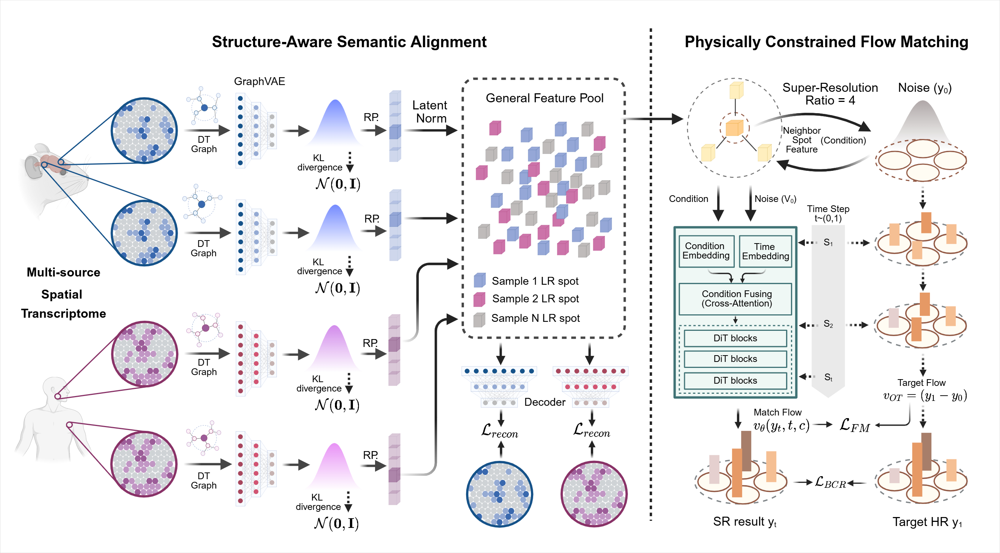

# SRast Core (Training + Inference)

SRast is a physically constrained generalist framework for spatial transcriptomics super-resolution that improves zero-shot generalization across species, tissues, and platforms. It decouples gene semantic representation from spatial geometry deconvolution and predicts simplex ratios with an optimal transport flow-matching model to enforce local mass conservation.



## Project Structure

- `train_stage1_single.py`: Stage 1 training entrypoint
- `train_stage2.py`: Stage 2 training entrypoint
- `inference.py`: Stage 2 inference entrypoint
- `configs/stage1_config.yaml`: Stage 1 config
- `configs/stage2_config.yaml`: Stage 2 config
- `configs/data_config_4x.yaml`: dataset paths and dataset groups
- `data/`, `models/`, `utils/`: core implementation modules

## Environment

Install dependencies:

```bash
pip install -r requirements.txt
```

GPU inference requires a CUDA-enabled PyTorch installation. Check GPU access with:

```bash
python - <<'PY'
import torch
print(torch.cuda.is_available())
print(torch.cuda.get_device_name(0) if torch.cuda.is_available() else "cpu")
PY
```

## Data Configuration

Edit dataset paths in:

- `configs/data_config_4x.yaml`

Each dataset should provide:
- `lr_path`: low-resolution `.h5ad`
- `hr_path`: high-resolution `.h5ad`

## Release Weights

Pretrained flow-matching checkpoint:

- 4x: `chechpoints/flow_matching_model.pt`

The checkpoint already stores `n_genes`, `latent_dim`, `flow_config`, and `model_state_dict`, so `inference.py` can rebuild the model automatically.

## Release Inference

The inference script needs Stage 1 latent outputs and preprocessors under `stage1_dir`.
Set `stage1_dir` in `configs/stage2_config.yaml` to the directory containing Stage 1 outputs, such as `checkpoints/stage1`.

4x example:

```bash
python inference.py \
  --config configs/stage2_config.yaml \
  --model_path chechpoints/flow_matching_model.pt \
  --sample_id HLN_A1 \
  --num_steps 50 \
  --device cuda \
  --output_dir results/open_release_tests/4x_numsteps50
```

Test all configured samples with `--test_all`. Add `--save_predictions` or `--save_h5ad` to export outputs.


## Run Stage 1

Train one sample:

```bash
python train_stage1_single.py --sample_id HLN_A1 --config configs/stage1_config.yaml
```

Outputs are saved to `checkpoints/stage1/<sample_id>/` by default.

## Run Stage 2

Train flow matching:

```bash
python train_stage2.py --config configs/stage2_config.yaml
```

By default, Stage 2 reads Stage 1 outputs from `checkpoints/stage1`.

## Run Inference

Test all configured test samples:

```bash
python inference.py --config configs/stage2_config.yaml --test_all
```

Test one sample:

```bash
python inference.py --config configs/stage2_config.yaml --sample_id HLN_A1
```

## Notes

- Stage 1 must be completed for the samples used in Stage 2 and inference.
- Keep `n_hvg` and model dimensions consistent between Stage 1 and Stage 2.
